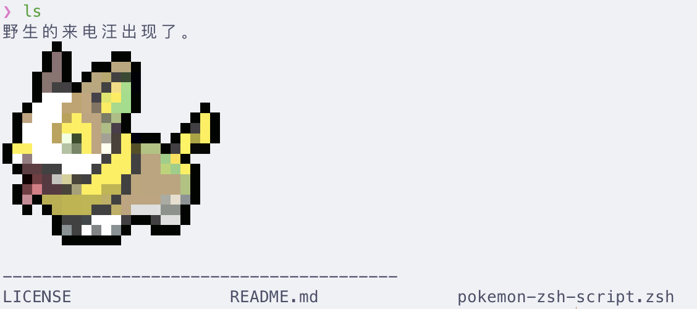

# pokemon-zsh-script
宝可梦zsh脚本

## 配置步骤

1. 根据教程配置 [pokemon-colorscripts](https://gitlab.com/phoneybadger/pokemon-colorscripts)。

2. 将本脚本保存到指定位置（假设路径为 `/xxx/pokemon-zsh-script.zsh`）。

3. 编辑 .zshrc 文件，添加以下内容：

```bash
source /xxx/pokemon-zsh-script.zsh
```

4. 运行 `source ~/.zshrc` 命令使配置生效

5. 尝试执行 `ls` 命令，配置正确的话应该会显示出当前目录对应的宝可梦


## 示例
配置完成后的 `ls` 展示：

